# Data Warehousing Project for Car Sales Kaggle Dataset

## Overview:

1. Installs dependencies such as pandas, psql-client CLI, pyscopg2, kaggle api, and python-dotenv
2. Imports data from Kaggle
3. Transforms the data from Kaggle to dimension tables and fact table and saves them to CSV format. Duplicate and missing values were handled. 
4. Sets up a PostgreSQL instance using Docker Compose
5. Creates dimension tables and fact table in the PostgreSQL instance
6. Inserts the data from the CSV files to the appropriate tables in the PostgreSQL instance
7. Queries the PostgreSQL instance to verify the accuracy of the data warehouse.

## Manual Setup Needed:

1. The project was developed in a WSL2 enivronment in Windows 11 using Ubuntu 24.04 as distro and VSCode as IDE. If WSL2 is not yet enabled in your machine, follow these instrcutions [https://learn.microsoft.com/en-us/windows/wsl/install](https://learn.microsoft.com/en-us/windows/wsl/install).
2. Manually install Docker Desktop [https://www.docker.com/products/docker-desktop/](https://www.docker.com/products/docker-desktop/) in your machine and setup WSL2 integration [https://docs.docker.com/desktop/features/wsl/](https://docs.docker.com/desktop/features/wsl/). Make sure Docker Desktop is running for the duration of the script.
3. Make sure you have Python 3 installed in your machine along with pip. You can follow these instrcutions [https://learn.microsoft.com/en-us/windows/python/web-frameworks](https://learn.microsoft.com/en-us/windows/python/web-frameworks).
4. All contents of this folder should be in a folder in your home directory called **dwproject**. The working project directory is **~/dwproject**. You can just clone this repo in your home folder using ```git clone https://github.com/aex1994/dwproject```.
5. Rename the **env.txt** file to **.env**
6. Create a Kaggle account [https://www.kaggle.com/](https://www.kaggle.com/) and generate your API token. The downloaded API token, kaggle.json, should be copied inside this directory **~/.config/kaggle**
7. Run this bash command inside the project folder **~/dwproject**
```bash 
sudo chmod 777 mainscript.sh
```
8. Run mainscript.sh using the command 
```bash
./mainscript.sh
```
9. Additionally, you can run the code below if you want to delete all generated csv files to save storage space. Just make sure to perform 
```bash
sudo chmod 777 rmcsvfiles.sh
./rmcsvfiles.sh
```

## Pipeline:

### Installing Dependencies

**mydependecies.py** installs the following:

1. kaggle API -> for extracting the car_sales dataset in Kaggle
2. pandas -> for transforming the dataset from kaggle to CSV files structured as fact table and dimension tables
3. psycopg2-bin -> for connecting to the PostgreSQL instance and creating the necessary tables suited for the CSV files generated from the transformation
4. postgresql-client-16 -> for connecting to the PostgreSQL instance and running sample queries
5. python-dotenv -> for python to access the .env file where credentials are stored and used in connecting to the PostgreSQL instance

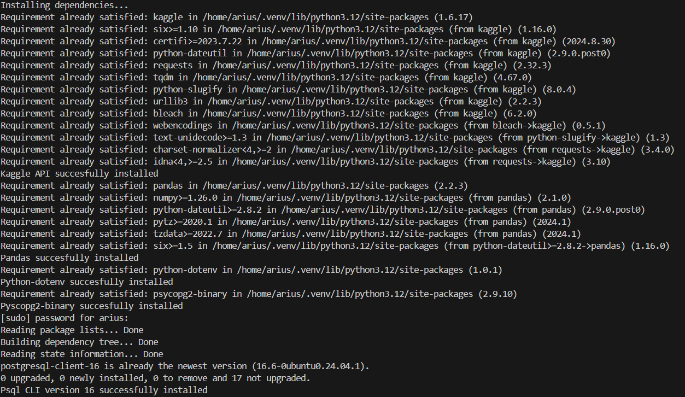

### Data Extraction

The **importdata.py** code extracts the car sales dataset from Kaggle and renames it to **Vehicle_sales_data.csv**

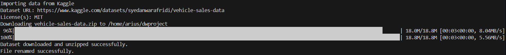

### Data Transformation

The **transform.py** code uses pandas and numpy to make the necessary transformations on the dataset and load them into CSV files. The transformation includes:

1. Dropping of duplicate rows by checking duplicate **vin** values because **vin** is supposed to be unique for each row:
```python
df.drop_duplicates(subset='vin', inplace=True)
```
2. Handling missing values using the following functions:

    a. fillna_with_mode -> imputes missing values by getting the mode of for the target column based on a reference column. For example, when imputing missing values for the column **make**, instead of getting the mode of the entire **make** column, it is grouped by the column **seller**, then the mode for each group is used to impute the missing values for the **make** column. This is smart way of mitigating the errors and uncertainty that comes with missing value imputation. In cases of two or more modes, the first mode will be used and if there are no modes, the value is **np.nan** to denote an empty value.

    ```python
    def fillna_with_mode(target_col, reference_col, dataframe):
    
    most_freq = dataframe.groupby(reference_col)[target_col] \
        .agg(lambda x: x.mode()[0] if not x.mode().empty else np.nan)
    most_freq = most_freq.reset_index(name = 'most_freq')
    
    merged = pd.merge(dataframe, most_freq, on=reference_col, how='left')
    dataframe[target_col] = dataframe[target_col].fillna(merged['most_freq'])
    return dataframe
    ```

    b. fillna_with_mean -> imputes missing values for the columns with numerical values such as the **mmr** and **sellingprice** columns. No further strategies were employed here unlike the function above.

    ```python
    def fillna_with_mean(target_col, dataframe):
    
    mean_value = int(dataframe[target_col].mean())
    dataframe[target_col] = dataframe[target_col].fillna(mean_value)
    return dataframe
    ```
3. Transforming the date column to a more structured format for data warehousing.

    a. Extracting the date part from the exisiting **saledate** column using string splicing
    ```python
    df['saledate_new'] = df['saledate'].str[4:15]
    ```
    b. Extracting the weekday name from the existing **saledate** column using string splicing
    ```python
    df['saledate_weekdayname'] = df['saledate'].str[0:3]
    ```
    c. Mapping the the weekday name to a weekday numerical value using a function **generate_weekday**. Ex. Mon = 1, Tue = 2.
    ```python
    def generate_weekday(dataframe):
    weekday_map = {'Mon':1, 'Tue':2, 'Wed':3, 'Thu':4, 'Fri':5, 'Sat':6, 'Sun':7}
    dataframe['saledate_weekday'] = dataframe['saledate_weekdayname'].map(weekday_map)
    return dataframe
    ```
    ```python
    df = generate_weekday(df)
    ```
    d. Casting the **saledate_new** column to pandas datetime format for easier extraction of the year, month, month name quarter, quarter name, day
    ```python
    #format saledate_new to datetime
    df['saledate_new'] = pd.to_datetime(df['saledate_new'])
    #drop the saledate column then rename saledate_new to saledate
    df.drop('saledate', axis=1, inplace=True)
    df.rename(columns={'saledate_new': 'saledate'}, inplace=True)
    #add a column for year, month and day
    df['saledate_year'] = df['saledate'].dt.year
    df['saledate_month'] = df['saledate'].dt.month
    df['saledate_monthname'] = df['saledate'].dt.month_name()
    df['saledate_day'] = df['saledate'].dt.day
    #add a quarter and a quartername column
    df['quarter'] = df['saledate'].dt.quarter
    df['quartername'] = 'Q' + df['quarter'].astype(str)
    ```
4. After all the imputations are done, all other rows that still have a missing value will be dropped from the dataset.
5. Final casting of proper data types to all the columns of the dataframe.
6. Summarizes the transformation showing how many rows were dropped and the data type of each column.

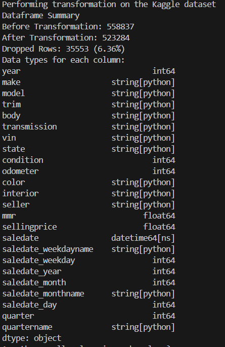

7. Final check if there are missing values in the dataset and a sneak peek ot the first 5 rows of the dataframe

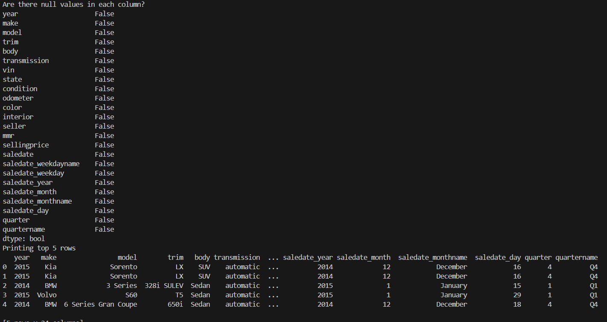

8. Creating multiple dataframes by splicing the original dataframe. This is done so that we can load the multiple dataframes into CSV files which are suited for fact table and dimension tables.

    Here is one example:

    ```python
    dateDimTable = df[['saledate', 'saledate_year', 'saledate_month', 'saledate_monthname','saledate_day',
                    'saledate_weekday', 'saledate_weekdayname', 'quarter', 'quartername', 
                    ]].drop_duplicates()
    dateDimTable = dateDimTable.copy()
    dateDimTable['date_id'] = dateDimTable.reset_index().index+1
    dateDimTable.to_csv('~/dwproject/dateDimTable.csv', index=False)
    print('dateDimTable.csv created')
    ```

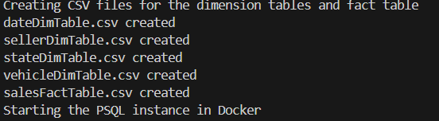

### Running a PostgreSQL Instance in Docker

The **psqldocker.py** code contains the functions for creating a PosgreSQL instance using docker-compose.

1. psqldocker_up -> establishes a PostgrSQL instance in the a docker container using the **docker-compose.yml** file
```python
def psqldocker_up():

    # Command to run the docker-compose.yml file to start a PSQL instance
    run_psql = ['docker-compose', 'up', '-d']
    
    # Run the run_psql command
    try:
        subprocess.run(run_psql, check=True)
        print('PSQL instance successfully launched')
    
    except subprocess.CalledProcessError as e:
        print(f"Error starting the PSQL instance: {e}")
```
2. docker-compose.yml -> contains the configuration on how to setup the containerized PostgreSQL instance in Docker
```yml
services:
  db:
    image: postgres:16  # Use the desired version of PostgreSQL
    container_name: postgres_instance
    environment:
      POSTGRES_USER: ${POSTGRES_USER}       # Username for the PostgreSQL instance stored in .env
      POSTGRES_PASSWORD: ${POSTGRES_PASSWORD}  # Password for the PostgreSQL instance stored in .env
      POSTGRES_DB: ${POSTGRES_DB}      # Name of the database to create stored in .env    
    ports:
      - "5433:5432"  # Expose PostgreSQL on the host machine's port 5432
```
3. Docker Desktop showing the containeraized PostgreSQL instance
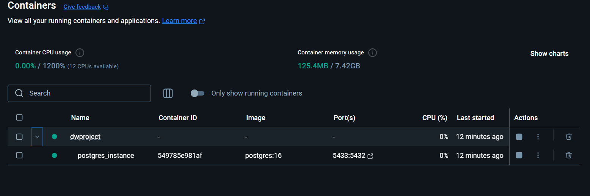

### Creating the Dimension and Fact Tables and Loading the CSV Files in the PostgreSQL Instance

The data model was created using PgAdmin ERD tool. The SQL command to create the tables were also generated by the ERD tool and is stored as a function in the **sqlqueries.py** with the name **sql_query_creating_tables**

ERD
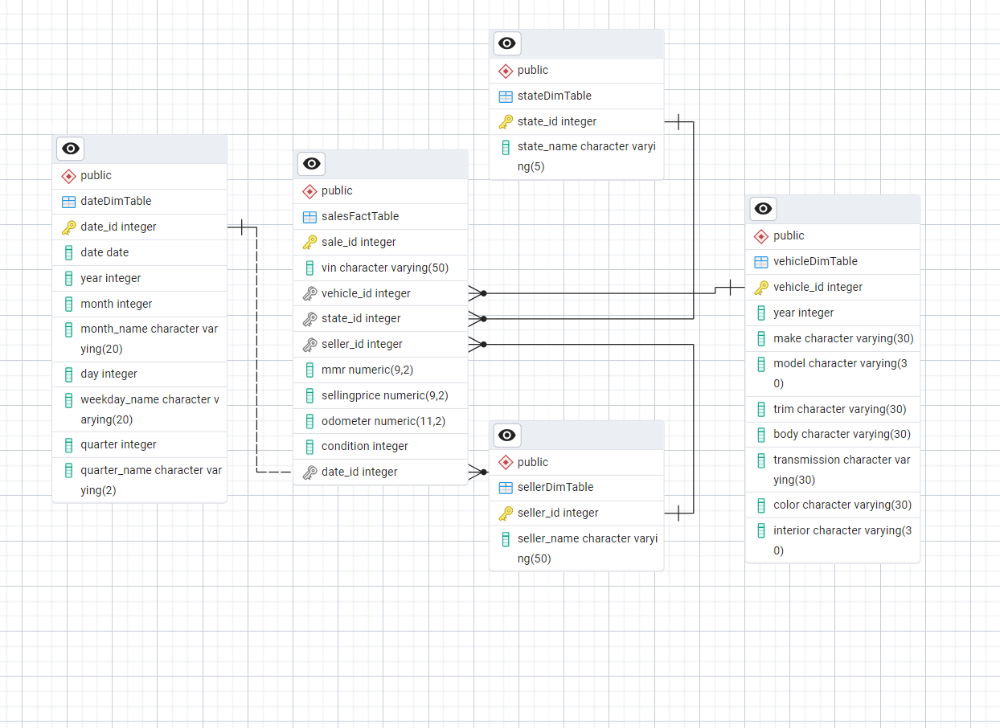

1. psql_conn -> a function in **psqlconnect.py** that connects to the PostgreSQL instance using **psycopg2**. This function also handles the waiting time for the PostgreSQL instance to be setup completely using a timeout counter.

2. create_tables -> a function in **psqlconnect.py** which uses the connection object returned by the **psql_conn** function, this code created the dimension and fact tables. The actual SQL command is a function in the **sqlqueries.py** with the name **sql_query_creating_tables** **psql**.

3. There are several functions in the **psqlconnect.py** for inserting the data from the CSV files to each PostgreSQL tables. For this process, the library **subprocess** was used and not the **psycopg2**. The **dotenv** library allows the code to access variables in the **.env** file and the db password is stored in **os.environ['PGPASSWORD']** for automation.

    Here is one example:
    ```python
    # Load environment variables from the .env file
    load_dotenv()

    # expanded project directory path
    file_path = os.path.expanduser('~/dwproject/')

    # Read connection information from environment variables
    hostname = 'localhost'
    username = os.getenv('POSTGRES_USER')
    pw = os.getenv('POSTGRES_PASSWORD')
    port_used = '5433'
    db = os.getenv('POSTGRES_DB')
    os.environ['PGPASSWORD'] = pw

    # Base command for using psql cli
    psql_command = ['psql', '-h', hostname, '-U', username, '-d', db,'-p', port_used, '-c']

    def insert_sellerdimtable():
        
        psql_command.append(f"\\copy \"sellerDimTable\"(seller,seller_id) FROM '{file_path}sellerDimTable.csv' DELIMITER ',' CSV HEADER;")

        try:
            subprocess.run(psql_command, check=True)
            print('Successfully inserted data to sellerDimTable in the PSQL instance')
        except subprocess.CalledProcessError as e:
            print(f"Error inserting data to sellerDimTable: {e}")
            
        psql_command.pop()
    ```

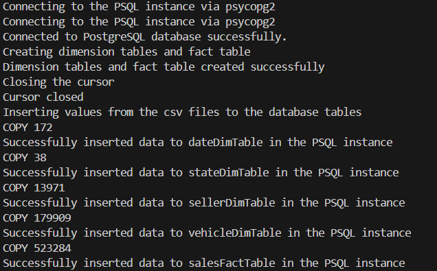

### Querying the Database

In this part, the database is queried to check if it is functional.

1. sql_verify_queries -> this is a function in **psqlconncet.py** which runs prepared SQL queries from **sqlqueries.py**.

```python
def sql_verify_queries():
    
    psql_command.append(query_1())
    
    try:
        print('First 5 rows of dateDimTable')
        subprocess.run(psql_command, check=True)
    except subprocess.CalledProcessError as e:
        print(f"Error querying database table: {e}")  
    
    psql_command.pop()
```

Here are two examples of a query from **sqlqueries.py**

```python
def query_1():

query = 'SELECT * FROM public."dateDimTable" LIMIT 5;'           
return query
```

```python
def query_6():

query = '''SELECT v.make, COUNT(v.make) AS units_sold FROM "salesFactTable" AS s LEFT JOIN "dateDimTable" AS d 
        ON s.date_id = d.date_id LEFT JOIN "sellerDimTable" AS sel ON sel.seller_id = s.seller_id LEFT JOIN "stateDimTable" AS st 
        ON st.state_id = s.state_id LEFT JOIN "vehicleDimTable" AS v ON v.vehicle_id = s.vehicle_id GROUP BY v.make ORDER BY units_sold DESC LIMIT 10;'''         
return query
```

There are 7 queries in total and here are the output of each query:

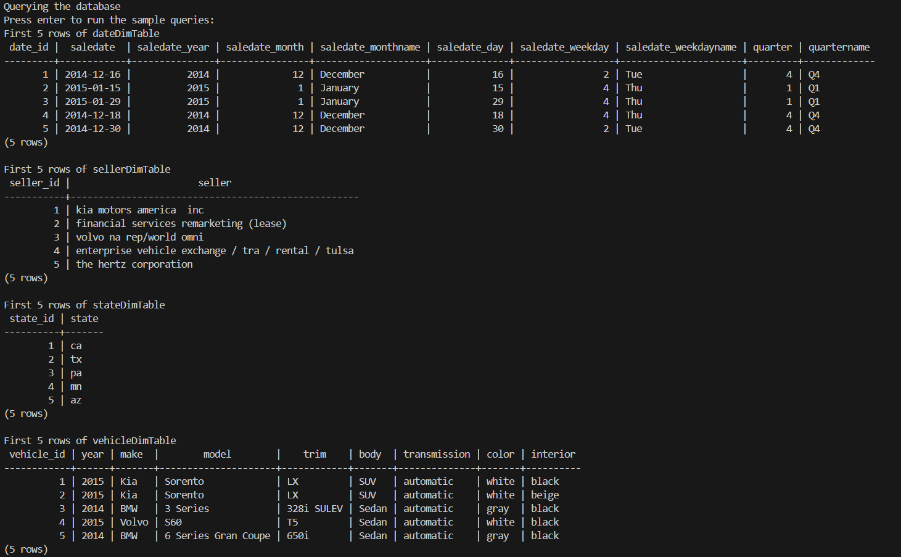
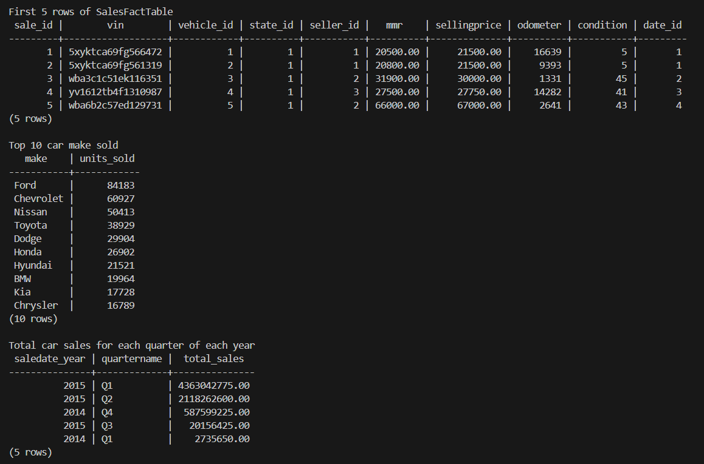

### Closing the Pipeline

For closing the ETL pipeline, the environment variable PGPASSWORD will be deleted then the psycopg2 connection will be closed. The docker container will be the last one to be closed.

Clearing the environment variable PGPASSWORD
```python
    # Get a user input to proceed to closing the connection and stopping the db instance
    input('Press enter to close the connection and stop the PSQL instance: ')
    
    # Clear the stored environment variable PGPASSWORD
    print('Is PGPASSWORD still in environment variables?', end=' ')
    print('PGPASSWORD' in os.environ)
    print('Clearing environment variables')
    del os.environ['PGPASSWORD']
    print('Is PGPASSWORD still in environment variables?', end=' ')
    print('PGPASSWORD' in os.environ) 
```

Closing the psycopg2 connection -> psql_close is function in the **psqlconncect.py** code
```python
def psql_close(conn):
    
    # Close the psql connection
    try:
        conn.close()
        print('Connection to the PostgreSQL database closed')
    
    except OperationalError as e:
        print(f"Error: {e}")
        return None
```

Closing the docker container -> psqldocker_down is function in the **psqldocker.py** code
```python
def psqldocker_down():

    # Command to stop the running PSQL instance
    run_psql = ['docker-compose', 'down', '-v']
    
    # Run the run_psql command
    try:
        subprocess.run(run_psql, check=True)
        print('PSQL instance successfully stopped')
    
    except subprocess.CalledProcessError as e:
        print(f"Error stopping the PSQL instance: {e}")
```

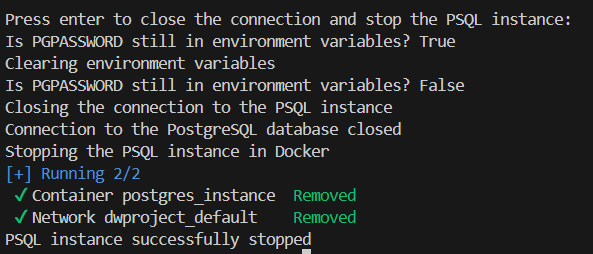